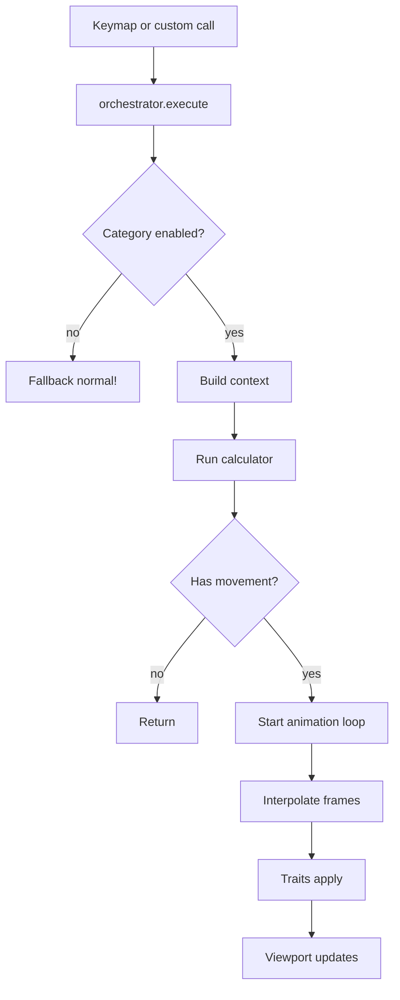
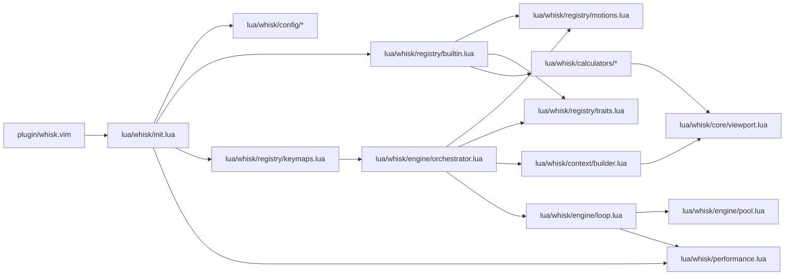

# Whisk Architecture

Whisk is organized around a motion registry, a context/calculator layer that computes target positions, and an animation engine that interpolates cursor/viewport state over time.

## High-level flow

1. A keymap (or a custom call) triggers `whisk.engine.orchestrator.execute()`.
2. The orchestrator builds a context snapshot (cursor, viewport, buffer, input).
3. The motion's calculator returns a target cursor/viewport result.
4. The animation loop interpolates from context -> result over time.
5. Trait handlers apply each interpolated frame to Neovim.

## Diagrams

### Runtime flow



### Module overview



## Module map

- `plugin/whisk.vim`
  - Defines `:Whisk*` commands.
  - Auto-calls `require("whisk").setup()` unless `g:whisk_auto_setup = 0`.

- `lua/whisk/init.lua`
  - Main entrypoint for setup/reset and global toggles.
  - Validates/updates config, sets up performance mode, registers builtins, installs keymaps.

- `lua/whisk/config/*`
  - `defaults.lua`: default configuration.
  - `validation.lua`: config validation for cursor/scroll/keymaps.
  - `management.lua`: get/update/reset of live config state.

- `lua/whisk/registry/*`
  - `motions.lua`: registers motion definitions and categories.
  - `traits.lua`: registers traits and per-trait animation state.
  - `keymaps.lua`: installs keymaps for all registered motions.
  - `builtin.lua`: registers built-in traits and motions.

- `lua/whisk/context/builder.lua`
  - Builds the input context (cursor, viewport, buffer, input args).

- `lua/whisk/calculators/*`
  - Motion calculators that produce target cursor/viewport positions.
  - Some calculators use native `normal!` motions for accuracy and then restore the cursor.

- `lua/whisk/engine/*`
  - `orchestrator.lua`: chooses motions, guards by config, starts animations, handles fallback.
  - `loop.lua`: frame loop and easing interpolation.
  - `pool.lua`: object pool for animation frames.

- `lua/whisk/core/viewport.lua`
  - Window/viewport helpers and a short-lived cache for window metrics.

- `lua/whisk/performance.lua`
  - Performance mode toggles and frame-rate adjustments.

- `lua/whisk/cursor/keymaps.lua` and `lua/whisk/scroll/keymaps.lua`
  - Deprecated wrappers around the orchestrator.

## Runtime orchestration

`orchestrator.execute(motion_id, input)` performs:

- Lookup the motion definition from the registry.
- Check category config (`cursor` or `scroll`) is enabled; otherwise fallback to `normal!`.
- Stop existing animations if the same trait is already animating.
- Build a context snapshot via `context.builder`.
- Run the calculator and exit early if there is no movement.
- Mark traits as animating and start the frame loop with duration/easing.

## Animation engine

The animation loop (`engine/loop.lua`) does the following:

- Uses `vim.loop.hrtime()` for high-resolution timing.
- Interpolates cursor/viewport values with easing (`linear`, `ease-in`, `ease-out`, `ease-in-out`).
- Applies the interpolated state by calling each trait's `apply()` function.
- Releases animation objects back into a pool to reduce allocations.
- Uses `performance.get_frame_interval()` to choose ~60fps or ~30fps.

## Traits

Traits are small apply functions that know how to apply a frame:

- `cursor` trait uses `viewport.set_cursor_position()`.
- `scroll` trait uses `viewport.restore_view()`.

Traits also track animation state to prevent overlapping animations of the same type.

## Calculators and context

Calculators return a table shaped like:

```lua
{
  cursor = { line = ..., col = ... },
  viewport = { topline = ... },
}
```

Inputs come from `context.builder`:

- `context.cursor`: current cursor line/col.
- `context.viewport`: topline, height, width.
- `context.buffer`: line count.
- `context.input`: `count`, `direction`, and optional `char`.

Basic motions calculate directly. Word/find/search/text-object motions delegate to `normal!` for accuracy.

## Performance and caching

- `core/viewport.lua` caches window metrics for ~50ms to reduce API calls.
- `engine/pool.lua` reuses animation tables (max pool size 10).
- Performance mode can disable syntax highlighting, reduce frame rate, and auto-enable for large buffers.
- `performance.ignore_events` is tracked by the performance module but not consumed by the core loop.

## Extension points

- Use `whisk.engine.orchestrator.execute()` for custom keymaps.
- Built-ins are registered through `whisk.registry.builtin`.
- Advanced extensions can register motions or traits via `whisk.registry.motions.register()` and `whisk.registry.traits.register()`.
