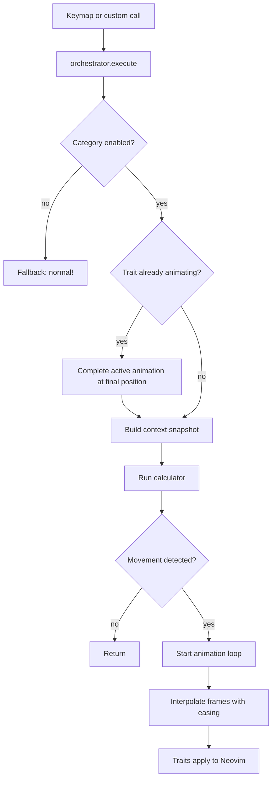
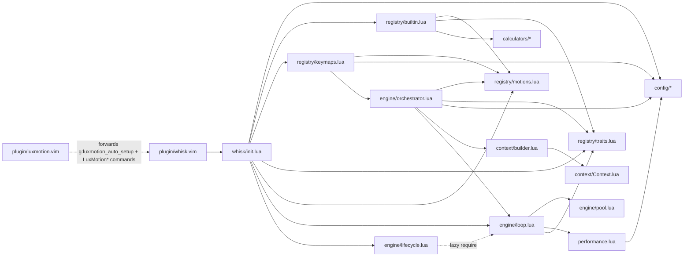

# Architecture

whisk.nvim is organized around a motion registry, a context layer that captures buffer/window state, calculators that compute target positions, and an animation engine that interpolates between start and target over time.

---

## High-level flow

1. A keymap (or custom call) triggers `orchestrator.execute(motion_id, input)`.
2. The orchestrator checks if the motion's category is enabled. If not, it falls back to `normal!`.
3. If any of the motion's traits are already animating, all active animations complete instantly at their final positions (domination).
4. The context builder captures a snapshot of cursor, viewport, and buffer state.
5. The motion's calculator returns a target cursor/viewport position.
6. The animation loop interpolates from start to target over time, applying easing.
7. Trait handlers apply each interpolated frame to Neovim.

---

## Module structure

```
lua/whisk/
  init.lua                    Main entry point (setup, toggles)
  config.lua                  Config facade (re-exports submodules)
  performance.lua             Performance mode and frame monitoring

  config/
    defaults.lua              Default configuration values
    validation.lua            Config validation
    management.lua            Runtime config get/update/reset

  registry/
    builtin.lua               Registers built-in traits and motions
    motions.lua               Motion definition store
    traits.lua                Trait store and animation state
    keymaps.lua               Keymap installation from registry

  context/
    Context.lua               Context class (buffer/window snapshot + methods)
    builder.lua               Builds a hydrated context from input

  calculators/
    init.lua                  Aggregator for all calculator modules
    basic.lua                 h, j, k, l, 0, $ (direct math)
    word.lua                  w, b, e, W, B, E (native delegation)
    find.lua                  f, F, t, T (native delegation, requires char)
    text_object.lua           {, }, (, ), % (native delegation)
    line.lua                  gg, G, | (direct math + viewport calculation)
    search.lua                n, N, gj, gk (native delegation; gj/gk are screen-line motions colocated here)
    scroll.lua                ctrl_d/u/f/b, zz/zt/zb (direct math)

  engine/
    orchestrator.lua          Motion execution, domination, fallback
    loop.lua                  Animation loop, easing, frame interpolation
    pool.lua                  Object pool for animation tables
    lifecycle.lua             Autocmd-based animation cancellation

  cursor/
    keymaps.lua               Deprecated cursor motion wrappers
  scroll/
    keymaps.lua               Deprecated scroll motion wrappers

  utils/
    visual.lua                Visual mode helpers

lua/luxmotion/
  init.lua                    Deprecation shim (forwards to whisk with warning)

plugin/
  whisk.vim                   VimScript entry point (auto-setup, commands)
  luxmotion.vim               Deprecation shim (forwards g:luxmotion_auto_setup and LuxMotion* commands)
```

---

## Runtime flow



---

## Module dependencies



Dashed lines indicate lazy `require()` calls (deferred to function call time rather than module load time). Note that `init.lua` lazily requires `performance.lua` inside `setup()`, but since `loop.lua` eagerly requires `performance.lua` at module load time, performance is always loaded transitively when `init.lua` loads `loop`.

---

## Orchestrator

`orchestrator.execute(motion_id, input)` performs:

1. Look up the motion definition from `motions.get(motion_id)`.
2. Check category config (`cursor` or `scroll`) is enabled. If disabled, call `fallback()` which runs `normal! [count]<key>[char]` (count is only prepended when greater than 1).
3. Check if any of the motion's traits are currently animating. If so, call `loop.complete_all()` to snap **all** active animations to their final positions (domination). The check is per-trait, but the effect is global.
4. Build a context snapshot via `context.builder.build(input)`.
5. Run the calculator. Exit early if no result or if the cursor hasn't moved.
6. Mark all motion traits as animating.
7. Start the animation loop with the context, result, traits, duration, and easing. The `on_complete` callback clears all trait animating flags.

---

## Context

The context layer captures a snapshot of Neovim state and provides safe mutation methods.

### Context class (`context/Context.lua`)

Constructed via `Context.new(bufnr, winid)`. Captures buffer and window state at construction time in `self.start`:

| Method | Description |
|--------|-------------|
| `is_valid()` | Returns false if buffer deleted, window closed, or buffer changed |
| `get_line_count()` | Current buffer line count |
| `get_line_length(line)` | Length of a specific line |
| `clamp_line(line)` | Clamp to valid line range |
| `clamp_column(col, line)` | Clamp to valid column range |
| `clamp_position(line, col)` | Clamp both line and column |
| `set_cursor(line, col)` | Validate, clamp, and set cursor position |
| `restore_view(topline, line, col)` | Validate, clamp, and restore viewport + cursor |

### Context builder (`context/builder.lua`)

`build(input)` constructs a Context and populates derived fields:

- `ctx.input` — `{ char, count, direction }`
- `ctx.cursor` — `{ line, col }` (1-indexed line from the snapshot)
- `ctx.viewport` — `{ topline, height, width }`
- `ctx.buffer` — `{ line_count }`

---

## Animation engine

### Loop (`engine/loop.lua`)

The animation loop uses `vim.defer_fn` for frame scheduling and `vim.loop.hrtime()` for high-resolution timing.

Each frame:

1. Records frame time via `performance.record_frame_time()`.
2. Iterates the frame queue in reverse for safe removal.
3. If the context has an `is_valid` method, validates via `context:is_valid()`. If invalid, fires `on_cancel` with a reason string, removes the animation, and skips to the next entry.
4. Computes `progress = elapsed / duration`, clamped to `[0, 1]`.
5. Applies the easing function to get `eased` progress.
6. Calls `interpolate_result()` to lerp cursor line/col and viewport topline between start and target.
7. Calls `traits.apply_frame()` for each trait.
8. When `progress >= 1.0`: fires `on_complete`, removes from queue, releases animation object to pool.
9. Reschedules itself if the queue is non-empty; otherwise stops.

Frame interval is determined by `performance.get_frame_interval()`: 16ms (~60fps) normally, 33ms (~30fps) when both performance mode is active and `reduce_frame_rate` is enabled.

**Easing functions:** `linear`, `ease-in`, `ease-out`, `ease-in-out`.

### Object pool (`engine/pool.lua`)

Recycles animation table allocations to reduce garbage collection pressure.

- Maximum pool size: 10 objects.
- `acquire()` returns a pooled object or allocates a new one.
- `release(animation)` resets all fields (numbers to 0, references to nil) and returns the object to the pool if under capacity.

### Lifecycle (`engine/lifecycle.lua`)

Creates a `WhiskLifecycle` augroup with three autocmds:

| Event | Action |
|-------|--------|
| `BufDelete` | Cancel animations for the deleted buffer |
| `WinClosed` | Cancel animations for the closed window |
| `BufLeave` | Cancel animations for the left buffer |

---

## Traits

Traits are small apply functions that know how to write an interpolated frame to Neovim:

- **cursor** trait calls `context:set_cursor(line, col)`.
- **scroll** trait calls `context:restore_view(topline, line, col)`.

Traits also track per-trait animation state to enable domination (preventing overlapping animations of the same type).

---

## Calculators

Calculators receive a context and return a target:

```lua
{
  cursor = { line = ..., col = ... },
  viewport = { topline = ... },
}
```

Two calculation strategies:

- **Direct math** — basic, line, and scroll calculators compute targets arithmetically from context values.
- **Native delegation** — word, find, search (including screen-line motions gj/gk), and text object calculators execute `normal!` motions to find the accurate target, then restore the cursor before returning the result.

---

## Performance mode

When enabled, performance mode:

- Conditionally disables syntax highlighting (`vim.bo.syntax = "off"`, restored on disable) when `disable_syntax_during_scroll` is set.
- Reduces frame rate from 60fps to 30fps when both performance mode is active **and** `reduce_frame_rate` is set.
- Populates a passive lookup table of ignored events (default: `WinScrolled`, `CursorMoved`, `CursorMovedI`). Callers check `should_ignore_event(event)` to decide whether to skip logic — no autocmds are registered to intercept events.
- Auto-enables on `BufEnter`/`BufWinEnter` for files exceeding `large_file_threshold` lines.
- Maintains a rolling window of the last 10 frame times for FPS calculation.
- Exposes `get_frame_interval()` and `get_current_fps()` for introspection.

Note: `frame_rate_threshold` is defined in defaults (`60`) but is not currently read by any code path. It exists as a placeholder for future use.

---

## Extension points

- **Custom keymaps** — call `orchestrator.execute()` directly with any registered motion ID.
- **Custom motions** — register via `require("whisk.registry.motions").register()`.
- **Custom traits** — register via `require("whisk.registry.traits").register()`.
- Built-in motions and traits are registered through `registry/builtin.lua` during setup.
